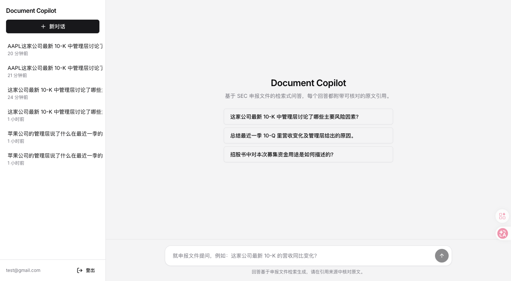
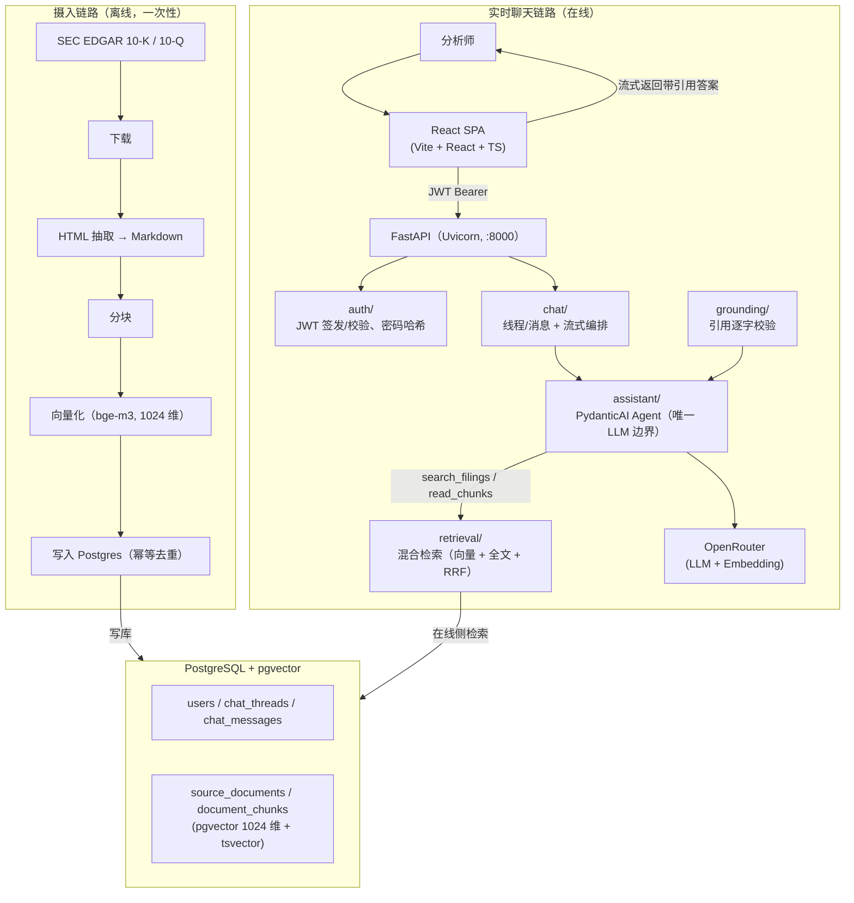

# Document Copilot

面向内部分析师（Driftwood Capital）的 AI 问答机器人：分析师用自然语言查询 SEC 披露文件（10-K / 10-Q）语料，得到**有据可依、可溯源引用**的答案。

## 界面预览



**信任契约是架构核心**：每条事实性陈述都必须引用检索到的原文段落；语料不足时必须明确失败（`evidence_sufficient=False`），绝不返回无据答案。宁可没有答案，也不给「自信但错误」的答案。

## 技术栈

| 层 | 选型 |
| --- | --- |
| 后端 | Python 3.12+ + FastAPI + Uvicorn |
| LLM 编排 | PydanticAI（类型化 agent），OpenAI SDK 经 OpenRouter 网关调用 |
| 前端 | Vite + React SPA + TypeScript（严格模式），**不是 Next.js** |
| UI | Tailwind CSS + shadcn/ui |
| 数据库 | PostgreSQL + pgvector（语义检索）+ Postgres 全文检索 |
| 迁移 | SQLAlchemy 模型 + Alembic |
| 认证 | FastAPI 自实现 JWT（邮箱 + 密码），无第三方 Auth/OAuth |
| 依赖管理 | 后端 `uv`，前端 `pnpm` |

## 架构图



两条链路通过**共享的嵌入客户端**（`backend/app/core/embeddings.py`）和**共享的 Postgres 表**衔接：离线侧写库、在线侧检索，必须用同一嵌入模型和同一向量维度（默认 `baai/bge-m3`，1024 维）。

### 核心流程

1. **摄入链路（离线）**：`ingest/` 包按 `data/downloads/manifest.json` 逐文件「下载 → HTML 抽取 Markdown → 分块 → 向量化 → 写入 Postgres」。幂等可重跑，check-then-insert 去重，不可并发运行。
2. **实时聊天链路（在线）**：FastAPI 端点 → JWT 鉴权 → PydanticAI agent 自主检索（工具循环：`search_filings` 返回 chunk 摘要，`read_chunks` 取完整正文）→ 事实依据校验（引用必须逐字落在检索段落内）→ 流式返回带引用答案并持久化。

### 混合检索 + RRF

`PgVectorRetriever.search()` 同时跑 pgvector 余弦相似度与 Postgres 全文检索，用倒数排名融合（RRF）合并后取 top_k，按 `corpus_owner_email` 过滤共享语料。

## 快速开始

### 前置要求

- Python 3.12+ 与 [uv](https://docs.astral.sh/uv/)
- Node.js + pnpm
- Docker（本地 Postgres）

### 后端

```bash
cd backend
uv sync                                        # 安装依赖（参考 .env.example 配置环境变量）
docker compose up -d postgres                  # 启动本地 pg16 + pgvector（端口 5432）
uv run alembic upgrade head                    # 应用数据库迁移
uv run uvicorn app.main:app --reload           # 启动开发服务器（端口 8000）
```

### 前端

```bash
cd frontend
pnpm install
cp .env.example .env    # 配置 VITE_API_BASE_URL（如 http://localhost:8000）
pnpm dev                # 启动开发服务器（端口 5173）
```

### 语料摄入

```bash
uv run data/download.py     # 仓库根目录：从 SEC EDGAR 下载 5 份 10-K（AAPL/MSFT/NVDA/AMZN/GOOGL）
cd backend && uv run -m ingest
```

## 常用命令

### 后端（在 `backend/` 下）

```bash
uv run pytest                                  # 全部测试（不含集成测试）
uv run pytest -m integration                   # 集成测试（需真实 DB/OpenRouter）
uv run ruff check . && uv run ruff format .    # lint / 格式化
uv run alembic revision --autogenerate -m "…"  # 生成迁移（需人工审查）
```

### 前端（在 `frontend/` 下）

```bash
pnpm build            # tsc -b && vite build
pnpm tsc --noEmit     # 类型检查
pnpm lint             # eslint
```

## 认证

- `POST /auth/register`、`POST /auth/login`、`POST /auth/refresh`、`POST /auth/logout`、`GET /me`
- 前端收到 401 时自动刷新 access token，失败则跳转登录页。

## 目录结构

```text
backend/
  app/
    api/           # 薄路由层（auth、chat）
    auth/          # JWT、密码哈希、get_current_user
    chat/          # 线程/消息业务 + 流式编排
    assistant/     # PydanticAI agent（唯一 LLM 边界）
    retrieval/     # 混合检索 + RRF
    grounding/     # 引用逐字校验
    core/          # config、共享嵌入客户端
    database/      # SQLAlchemy 模型 + 仓储
  ingest/          # 离线摄入流水线
  tests/           # pytest（unit + integration）
frontend/
  src/
    components/    # shadcn/ui 基础组件
    pages/         # 路由级页面
    chat/          # 聊天组件
    auth/          # 认证 API 与 token 管理
    lib/           # http / api / env
data/              # SEC 语料下载脚本（downloads/ 已 gitignore）
docs/              # 架构文档与界面截图
```

## 更多文档

- `docs/architecture.zh-CN.md` — 目标架构（source of truth）
- `docs/client-brief.md` — 客户一页纸（含 10 道示例分析师问题）
- `docs/guides/backend-setup.zh-CN.md` / `docs/guides/frontend-setup.zh-CN.md` — 环境搭建
